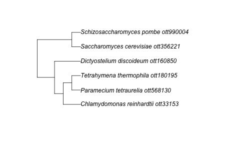
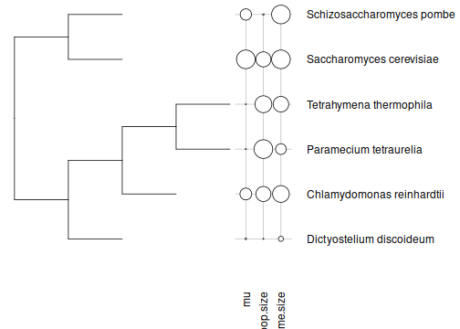

## Combining data from OToL and other sources.

One of the major goals of `rotl` is to help users combine data from other
sources with the phylogenetic trees in the Open Tree database. This examples
document describes some of the ways in which a user might connect data to trees
from Open Tree.

## Get Open Tree IDs to match your data.

Let's say you have a dataset where each row represents a measurement taken from
one species, and your goal is to put these measurements in some phylogenetic
context. Here's a small example: the best estimate of the mutation rate for a
set of unicellular Eukaryotes along with some other property of those species
which might explain the mutation rate:


```r
csv_path <- system.file("extdata", "protist_mutation_rates.csv", package = "rotl")
mu <- read.csv(csv_path, stringsAsFactors = FALSE)
mu
```

```
##                     species       mu pop.size genome.size
## 1   Tetrahymena thermophila 7.61e-12 1.12e+08    1.04e+08
## 2    Paramecium tetraurelia 1.94e-11 1.24e+08    7.20e+07
## 3 Chlamydomonas reinhardtii 2.08e-10 1.00e+08    1.12e+08
## 4  Dictyostelium discoideum 2.90e-11 7.40e+06    3.40e+07
## 5  Saccharomyces cerevisiae 3.30e-10 1.00e+08    1.25e+08
## 6       Saccharomyces pombe 2.00e-10 1.00e+07    1.25e+08
```

If we want to get a tree for these species we need to start by finding the
unique ID for each of these species in the Open Tree database. We can use the
Taxonomic Name Resolution Service (`tnrs`) functions to do this. Before we do
that we should see if any of the taxonomic contexts, which can be used to narrow
a search and avoid conflicts between different codes, apply to our group of species:


```r
library(rotl)
tnrs_contexts()
```

```
## Possible contexts:
##    Animals 
##       Birds, Tetrapods, Mammals, Amphibians, Vertebrates 
##       Arthropods, Molluscs, Nematodes, Platyhelminthes, Annelids 
##       Cnidarians, Arachnids, Insects 
##    Fungi 
##       Basidiomycetes, Ascomycetes 
##    All life 
##    Bacteria 
##       SAR group, Archaea, Excavata, Amoebozoa, Centrohelida 
##       Haptophyta, Apusozoa, Diatoms, Ciliates, Forams 
##    Land plants 
##       Hornworts, Mosses, Liverworts, Vascular plants, Club mosses 
##       Ferns, Seed plants, Flowering plants, Monocots, Eudicots 
##       Rosids, Asterids, Asterales, Asteraceae, Aster 
##       Symphyotrichum, Campanulaceae, Lobelia
```

Hmm, none of those groups contain all of our species. In this case we can
search using the `All life` context and the function `tnrs_match_names`:


```r
taxon_search <- tnrs_match_names(names = mu$species, context_name = "All life")
knitr::kable(taxon_search)
```


|search_string             |unique_name               |approximate_match | ott_id|is_synonym |flags | number_matches|
|:-------------------------|:-------------------------|:-----------------|------:|:----------|:-----|--------------:|
|tetrahymena thermophila   |Tetrahymena thermophila   |FALSE             | 180195|FALSE      |      |              1|
|paramecium tetraurelia    |Paramecium tetraurelia    |FALSE             | 568130|FALSE      |      |              1|
|chlamydomonas reinhardtii |Chlamydomonas reinhardtii |FALSE             |  33153|FALSE      |      |              1|
|dictyostelium discoideum  |Dictyostelium discoideum  |FALSE             | 160850|FALSE      |      |              1|
|saccharomyces cerevisiae  |Saccharomyces cerevisiae  |FALSE             | 356221|FALSE      |      |              1|
|saccharomyces pombe       |Schizosaccharomyces pombe |FALSE             | 990004|TRUE       |      |              1|

Good, all of our  species are known to Open Tree. Note, though, that one of the names
is a synonym. _Saccharomyces pombe_ is older name for what is now called
_Schizosaccharomyces pombe_. As the name suggests, the Taxonomic Name
Resolution Service is designed to deal with these problems (and similar ones
like misspellings), but it is always a good idea to check the results of
`tnrs_match_names` closely to ensure the results are what you expect.

In this case we have a good ID for each of our species so we can move on. Before
we do that, let's ensure we can match up our original data to the Open Tree
names and IDs by adding them to our `data.frame`:


```r
mu$ott_name <- unique_name(taxon_search)
mu$ott_id <- taxon_search$ott_id
```

## Find a tree with your taxa

Now let's find a tree. There are two possible options here: we can search for
published studies that include our taxa or we can use the 'synthetic tree' from
Open Tree. We can try both approaches.

### Published trees

Before we can search for published studies or trees, we should check out the
list of properties we can use to perform such searches:


```r
studies_properties()
```

```
## $tree_properties
##  [1] "ot:nearestTaxonMRCAOttId"         "ot:branchLengthTimeUnit"         
##  [3] "xsi:type"                         "ot:MRCAOttId"                    
##  [5] "ot:specifiedRoot"                 "ot:nearestTaxonMRCAName"         
##  [7] "ot:nodeLabelMode"                 "edgeBySourceId"                  
##  [9] "ntips"                            "ot:MRCAName"                     
## [11] "tb:quality.tree"                  "tb:type.tree"                    
## [13] "ot:nodeLabelDescription"          "ot:ottId"                        
## [15] "ot:outGroupEdge"                  "ot:branchLengthMode"             
## [17] "ot:ottTaxonName"                  "ot:branchLengthDescription"      
## [19] "rootedge"                         "ot:nodeLabelTimeUnit"            
## [21] "ot:unrootedTree"                  "label"                           
## [23] "tb:ntax.tree"                     "ot:studyId"                      
## [25] "tb:kind.tree"                     "meta"                            
## [27] "ot:curatedType"                   "ot:reasonsToExcludeFromSynthesis"
## [29] "ot:rootNodeId"                    "ot:tag"                          
## [31] "ot:messages"                      "nodeById"                        
## [33] "ot:inGroupClade"                 
## 
## $study_properties
##  [1] "prism:section"                 "nexmljson"                    
##  [3] "ot:focalCladeOTTTaxonName"     "treesById"                    
##  [5] "prism:pageRange"               "ot:agents"                    
##  [7] "xhtml:license"                 "xmlns"                        
##  [9] "dc:title"                      "ot:focalClade"                
## [11] "ot:curatorName"                "prism:volume"                 
## [13] "prism:startingPage"            "ot:otusElementOrder"          
## [15] "treebaseId"                    "prism:creationDate"           
## [17] "tb:identifier.study"           "id"                           
## [19] "nexml2json"                    "ot:comment"                   
## [21] "skos:historyNote"              "ot:candidateTreeForSynthesis" 
## [23] "prism:publicationDate"         "ot:notIntendedForSynthesis"   
## [25] "prism:endingPage"              "tb:title.study"               
## [27] "dc:publisher"                  "dc:subject"                   
## [29] "ntrees"                        "dc:date"                      
## [31] "ot:studyYear"                  "dcterms:bibliographicCitation"
## [33] "ot:studyPublication"           "version"                      
## [35] "prism:doi"                     "skos:changeNote"              
## [37] "dc:creator"                    "ot:annotationEvents"          
## [39] "about"                         "prism:publicationName"        
## [41] "dc:contributor"                "ot:treesElementOrder"         
## [43] "generator"                     "prism:modificationDate"       
## [45] "tb:identifier.study.tb1"       "ot:taxonLinkPrefixes"         
## [47] "ot:studyPublicationReference"  "prism:number"                 
## [49] "ot:studyId"                    "ot:tag"                       
## [51] "ot:dataDeposit"                "ot:messages"                  
## [53] "otusById"
```

We have `ottIds` for our taxa, so let's use those IDs to search for trees that
contain them.  Starting with our first species _Tetrahymena thermophila_ we can
use `studies_find_trees` to do this search.


```r
studies_find_trees(property = "ot:ottId", value = as.character(ott_id(taxon_search)[1]))
```

```
##    study_ids n_trees                       tree_ids candidate study_year
## 1    ot_1587       1                          tree1                 2015
## 2    ot_1589       1                          tree1                 2015
## 3    ot_2037       4 tree10, tree11, tree12, tree13                 2018
## 4     ot_409       2                   tree1, tree2     tree2       2015
## 5     ot_564       1                        Tr85317   Tr85317       2015
## 6     ot_579       1                        Tr60046                 2013
## 7     ot_700       1                          tree1     tree1       2016
## 8      ot_73       1                          tree1     tree1       2013
## 9     ot_766       1                        Tr85440                 2015
## 10    ot_767       1                          tree1     tree1       2016
## 11     ot_87       1                        Tr64119   Tr64119       2014
##                                                                                                                                    title
## 1  'Phylogenomic analyses reveal subclass Scuticociliatia as the sister group of subclass Hymenostomatia within class Oligohymenophorea'
## 2  'Phylogenomic analyses reveal subclass Scuticociliatia as the sister group of subclass Hymenostomatia within class Oligohymenophorea'
## 3                                                                                                                                       
## 4                                                                         Tree of life reveals clock-like speciation and diversification
## 5     'The alveolate translation initiation factor 4E family reveals a custom toolkit for translational control in core dinoflagellates'
## 6                                       'Convergent evolution of heat-inducibility during subfunctionalization of the Hsp70 gene family'
## 7                                                                                                       'A new view of the tree of life'
## 8                                           Deep relationships of Rhizaria revealed by phylogenomics: A farewell to Haeckel’s Radiolaria
## 9                                                                                 'Bacterial proteins pinpoint a single eukaryotic root'
## 10                 'Untangling the early diversification of eukaryotes: a phylogenomic study of the evolutionary origins of Centrohelida
## 11                        'Dinoflagellate phylogeny revisited: Using ribosomal proteins to resolve deep branching dinoflagellate clades'
##                                        study_doi n_matched_trees
## 1  http://dx.doi.org/10.1016/j.ympev.2015.05.007               1
## 2  http://dx.doi.org/10.1016/j.ympev.2015.05.007               1
## 3    http://dx.doi.org/10.1038/s41586-018-0708-8               3
## 4        http://dx.doi.org/10.1093/molbev/msv037               1
## 5    http://dx.doi.org/10.1186/s12862-015-0301-9               1
## 6      http://dx.doi.org/10.1186/1471-2148-13-49               1
## 7   http://dx.doi.org/10.1038/nmicrobiol.2016.48               1
## 8  http://dx.doi.org/10.1016/j.ympev.2012.12.011               1
## 9      http://dx.doi.org/10.1073/pnas.1420657112               1
## 10      http://dx.doi.org/10.1098/rspb.2015.2802               1
## 11 http://dx.doi.org/10.1016/j.ympev.2013.10.007               1
##            match_tree_ids
## 1                   tree1
## 2                   tree1
## 3  tree13, tree10, tree11
## 4                   tree2
## 5                 Tr85317
## 6                 Tr60046
## 7                   tree1
## 8                   tree1
## 9                 Tr85440
## 10                  tree1
## 11                Tr64119
##  [ reached 'max' / getOption("max.print") -- omitted 16 rows ]
```

Well... that's not very promising. We can repeat that process for all of the IDs
to see if the other species are better represented.


```r
hits <- lapply(mu$ott_id, studies_find_trees, property = "ot:ottId", detailed = FALSE)
sapply(hits, function(x) sum(x[["n_matched_trees"]]))
```

```
## [1]  51  51 129  71  17  88
```

OK, most of our species are not in any of the published trees available. You can
help fix this sort of problem by [making sure you submit your published trees to
Open Tree](https://tree.opentreeoflife.org/curator).

### A part of the synthesis tree

Thankfully, we can still use the complete Tree of Life made from the
combined results of all of the published trees and taxonomies that go into Open
Tree. The function `tol_induced_subtree` will fetch a tree relating a set of IDs.

Using the default arguments you can get a tree object into your R session:


```r
ott_in_tree <- ott_id(taxon_search)[is_in_tree(ott_id(taxon_search))]
tr <- tol_induced_subtree(ott_ids = ott_in_tree)
```

```
## Warning in collapse_singles(tr, show_progress): Dropping singleton nodes with
## labels: mrcaott2ott276, mrcaott2ott142555, mrcaott2ott1551, mrcaott2ott7623,
## Chloroplastida ott361838, Chlorophyta ott979501, mrcaott185ott42071,
## mrcaott185ott1426, mrcaott1426ott1544, mrcaott1544ott8659, mrcaott1544ott15345,
## mrcaott1544ott9282, mrcaott9389ott818260, mrcaott9389ott23557,
## mrcaott23557ott527099, mrcaott148ott902, SAR ott5246039, Alveolata ott266751,
## Ciliophora (phylum in subkingdom SAR) ott302424, Intramacronucleata
## ott340382, mrcaott1546ott1671, Conthreep ott5248773, mrcaott1671ott16129,
## Peniculia ott1002116, Paramecium (genus in subkingdom SAR) ott568126,
## mrcaott11752ott13570, Hymenostomatia ott5257367, Tetrahymena (genus in
## subkingdom SAR) ott47284, mrcaott295406ott523463, mrcaott295406ott523462,
## Amoebozoa ott1064655, mrcaott3973ott15653, mrcaott3973ott26103,
## mrcaott26103ott273110, mrcaott26103ott229626, Dictyostelia ott835575,
## Dictyosteliales ott4008839, Dictyosteliaceae ott4008841, Dictyostelium
## ott999665, Opisthokonta ott332573, Nucletmycea ott5246132, Fungi ott352914,
## mrcaott109ott3465, mrcaott109ott67172, mrcaott109ott1423, mrcaott109ott9352,
## h2007-2 ott5576447, h2007-1 ott5584405, Dikarya ott656316, Saccharomycetales
## ott4085960, Saccharomycetaceae ott989994, Saccharomyces ott908546,
## Schizosaccharomycetes ott921286, Schizosaccharomycetidae ott5670481,
## Schizosaccharomycetales ott508517, Schizosaccharomycetaceae ott990009,
## Schizosaccharomyces ott990008
```

```r
plot(tr)
```



### Connect your data to the tips of your tree

Now we have a tree for of our species, how can we use the tree and the data
together?

The package `phylobase` provide an object class called `phylo4d`, which is
designed to represent a phylogeny and data associated with its tips. In oder to
get our tree and data into one of these objects we have to make sure the labels
in the tree and in our data match exactly. That's not quite the case at the
moment (tree labels have underscores and IDs appended):


```r
mu$ott_name[1]
```

```
## $`Tetrahymena thermophila`
## [1] "Tetrahymena thermophila"
```

```r
tr$tip.label[4]
```

```
## [1] "Dictyostelium_discoideum_ott160850"
```

`rotl` provides a convienence function `strip_ott_ids` to deal with these.


```r
tr$tip.label <- strip_ott_ids(tr$tip.label, remove_underscores = TRUE)
tr$tip.label %in% mu$ott_name
```

```
## [1] TRUE TRUE TRUE TRUE TRUE TRUE
```

Ok, now the tips are together we can make a new dataset. The `phylo4d()`
functions matches tip labels to the row names of a `data.frame`, so let's make
a new dataset that contains just the relevant data and has row names to match
the tree


```r
library(phylobase)
mu_numeric <- mu[, c("mu", "pop.size", "genome.size")]
rownames(mu_numeric) <- mu$ott_name
tree_data <- phylo4d(tr, mu_numeric)
```
And now we can plot the data and the tree together


```r
plot(tree_data)
```



## Find external data associated with studies, trees and taxa from Open Tree

In the above example we looked for a tree that related species in another dataset.
Now we will go the other way, and try to find data associated with Open Tree records
in other databases.

### Get external data from a study

Let's imagine you were interested in extending or reproducing the results of a
published study. If that study is included in Open Tree you can find it via
`studies_find_studies` or `studies_find_trees` and retrieve the published trees
with `get_study`. `rotl` will also help you find external. The function
`study_external_IDs` retrieves the DOI for a given study, and uses that to
gather some more data:


```r
extra_data <- try(study_external_IDs("pg_1980"), silent = TRUE)
if (!inherits(extra_data, "try-error")) {
  extra_data
}
```

```
## External data identifiers for study 
##  $doi:  10.1016/j.ympev.2006.04.016 
##  $pubmed_id:  16762568 
##  $nucleotide_ids: vector of 58 IDs
##  $external_data_url http://purl.org/phylo/treebase/phylows/study/TB2:S1575
```

Here the returned object contains an `external_data_url` (in this case a link to
the study in Treebase), a pubmed ID for the paper and a vector IDs for the
NCBI's nuleotide database. The packages `treebase` and `rentrez` provide
functions to make use of these IDs within R.

As an example, let's use `rentrez` to download the first two DNA seqences and
print them.


```r
library(rentrez)
seqs <- try(entrez_fetch(db = "nucleotide", id = extra_data$nucleotide_ids[1:2], rettype = "fasta"), silent = TRUE)

if (inherits(seqs, "try-error")) {
  cat("NCBI temporarily down.")
} else {
  cat(seqs)
}
```

```
## >AM181011.1 Plectroninia neocaledoniense partial 28S rRNA gene, specimen voucher G316300 (Queensland Museum)
## GCTAGCAAGCGCGTCGGTGGTTCAGCCGGCTGGTCTCGTCGAGTTGTCGGTGTGCGGATCCGAACGGACC
## GCGGCCGATGGCGTCGGCGGGCAAGCTGTGGTGCACTCTGTCGGCGTGCGCGTCAGCGTCGGTTTCGGCC
## GGACGACGAGGCGCTCGGGGAAGGTAGCTGGACCGGTCTTCGGTGCAGTGTTATAGCCCTGGGCCGCTGG
## GTTCGGCGTTTGGGACCGAGGAGAGAGATGATCGCTGCAGCGCCTGTCTCCCTCTCGAGGGGGGCTAGCC
## AGCCGCTGTTTGGGTGGCGTCACTGGCGGAGGACTGCACGCAGTGCTTCGCCGGTGGTCGTGTCCAGGCG
## GGCGGTGTGGGTATAGAGGCGCTTAGGACGCTGGCGTCCAAATGGCCGTGCGCGACCCGTCTTGAAACAC
## GGACCAAGGAGTCTAGCATGTGCGCGAGTCTTAGGGTGTGGAAGCCCTCGGGCGCAATGAAAGTGAAGGG
## CCGTCGTCTCTCGGGGCTGCGGTGTGAGGTGAGAGCCGTCGCCGTCGGGTGGCGGTGCATCATCGGCCGG
## TCCATCCTGCTCTCAGGAGGATCTGCGCAAGAGCGTGTTTGCTGGGACCCGAAAGATGGTGAACTATGCC
## TGAATAGGGTGAAGCCAGAGGAAACTCTGGTGGAGGCTCGTAGCGGTTCTGACGTGCAAATCGATCGTCA
## AATTTGGGTATAGGGGCGAAAGACTAATCGAACCATCTAGTAGCTGGTTCCCTCCGAAGTTTCCCTCAGG
## ATAGCTGGAACTCGTCTTGACACAGTTTTATCAGGTAAAGCGAATGATTAGAGGTCTTGGGGGTGAAACA
## CCCTCAACCTATTCTCAAACTTTAAATAGGTAAGAAGCGCGACTTGCTCAATTGAAGTGGCGCGCAGTGA
## ATGTGAGTTCCAAGTGGGCCATTTTTGGTAAGCAGAACTGGCGATGCGGGATGAACCGAACGCTCGGTTA
## AGGTGCCCAAGTCGACGCTCATCAGACCCCAGAAAAGGTGTTGGTCGATATAGACAGCAGGACGGTGGCC
## ATGGAAGTCGGAATCCGCTAAGGAGTGTGTAACAACTCACCTGCCGAATCAACTAGCCCTGAAAATGGAT
## GGCGCTCAAGCGTCGCACCTATACCGAGCCGTCGTGGTAAATGCCAGGCCACGACGAGTAGGAGGGCGCG
## GTGGTCGTGACGCAGCCCTTGGCGCGAGCCTGGGCGAAACGGCCTCCGGTGCAGATCTTGGTGGTAGTAG
## CAAATATTCAAATGAGAGCTTTGAAGACCGAAGTGGAGAAAGGTTCCATGTGAACAGCAGTTGGACATGG
## GTTAGTCGATCCTAAGAGATAGGGAAGTTCCGTGTGAAAGTGCGCAATGCGCTTCTGTGCTGCGCGCCTC
## CTATCGAAAGGGAATCGGGTTAATATTCCCGAACCGGAAGGCGGATATCTCTGGCTCTCGGGTCAGGAGC
## GGCAACGCAAGCGTACTGCGAGACGTCGGCGGGGGCTCCGGGAAGAGTTGTCTTTTCTTTTTAACGCAGT
## CGCCATCCCTGGAATCGGTTTGCCCGGAGATAGGGTTGGCTGGCTCGGTAAAGCAGCACACTTCATGTGC
## TGTCCGGTGCGCTCTCGACGGCCCTTGAAAATCGCAGGTGTGCATCGATTCTCGCATCCGGTCGTACTCA
## TAACCGCATCAGGTCTCCAAGGT
## 
## >AM181010.1 Eilhardia schulzei partial 28S rRNA gene, specimen voucher G316071 (Queensland Museum)
## GCTAGTAATGTACGTTGGTGGTTCAGCCGGCTAGTCTTGTCGAGTCGTCGTGTGGTGGATCCGACTGGAC
## CGTCCGCGGTGGTGTCGGCGGGCGAGCTGTGGTGCACTCTACGGACGTGCGCGTCAGCGTCGGTTCTCGA
## TGGGCGATAAGGTGCGTGGGGGAAGGTGGCTCGGTCCTTGGGAACTGAGTGTTACAGACCCTGGTGCTGG
## GCTCGTCGTGGGACCGAGGAGAGAGAGAGATGATCGCTGCGGCACCTGCCCCGTTGTCATTTTTCGGGGC
## TAGCCAGCCGTTTGTCAGGTGTGCGTCGGACGTTGAGGACTGCACGCAGTGCTGGACGTGGAGGCGTGAT
## CTGATGGCGGTGTGGGCATTAGAGGTGCCTAGGACGCTGGCGTCCAAATGGCCGTGCGCGACCCGTCTTG
## AAACACGGACCAAGGAGTCTAACATGTGCGCGAGTCTTAGGGTGTGCAAGCCCTCGGGCGCAATGAAAGT
## GAAGGCTCGGCGGCGCTAGTCGAGCTGAGGTGAGAGCCGTGGCCGTTGCATGTGGCGGCGGCGGCGCATC
## ATCGGCCGGTCCATCCTGCTCTCAGGGGGATCCGAGCAAGAGCGTATTTGTTGGGACCCGAAAGATGGTG
## AACTATGCCTGAATAGGGTGAAGCCAGAGGAAACTCTGGTGGAGGCTCGTAGCGATTCTGACGTGCAAAT
## CGATCGTCAAATTTGGGTATAGGGGCGAAAGACTAATCGAACCATCTAGTAGCTGGTTCCCTCCGAAGTT
## TCCCTCAGGATAGCTGGAGCTCTTGGACACAGTTTTATCAGGTAAAGCGAATGATCAGAGGTCTTGGGGG
## TGAAACACCCTCAACCTATTCTCAAACTTTAAATCGGTAAGAAGCGCGACTTGCTGAATTGAAGCCGCGC
## GCAAGCAATGTGAGTTCCAAGTGGGCCATTTTTGGTAAGCAGAACTGGCGATGCGGGATGAACCGAACGC
## TGGGTTAAGGTGCCAAAGTCGACGCTCATCAGACCCCAGAAAAGGTGTTGGTTGATATAGACAGCAGGAC
## GATGGCCATGGAAGTCGGAATCCGCTAAGGAGTGTGTAACAACTCACCTGCCGAATCAACTAGCCCTGAA
## AATGGATGGCGCTCAAGCGTCGCACCTATACCGGGCCGTCGTCGCAAATGCCAGGCGACGACGAGTAGGA
## GGGCGCAGTGGTCGTCATGCAGCCCTTGGCGTGAGCCTGGGTCAAACGGCCTCTGGTGCAGATCTTGGTG
## GTAGTAGCAAATATTCAAATGAGAGCTTTGAAGACCGAAGTGGAGAAAGGTTCCATGTGAACAGCAGTTG
## GACATGGGTTAGTCGATCCTAAGTGATAGGGGAGCTCCGTATGAAAGTGCGCAATCGGCCCTGCTTGTGT
## CGCCTTGCGCCACCTATCGAAAGGGAATCGGGTTAATATTCCCGAACCGGAAGGCGGATTTTCTCTGGCT
## CTCGGGTCAGGAGCGGCAACGCTAGCGAACCGCGAGACGTCGGCGGGGGCTCCGGGAAGAGTTGTCTTTT
## CTTTTTAACGCAGTCGCCATCCCTGGAATCGGTTTGCCCGGAGATAGGGTTGGCTGGCTCGGTAAAGCAG
## CACACTTCATGTGCTGTCCGGTGCGCTCTCGACGGCCCTTGAAAATCGCGGCGAGTGTAGTCTGATTTTC
## GCATCCGTTCGTACTCATAACCGCATCAGGTCTCCAAGGT
```

You could further process these sequences in R with the function `read.dna` from
`ape` or save them to disk by specifying a file name with `cat`.

### Find a OTT taxon in another taxonomic database

It is also possible map an Open Tree taxon to a record in another taxonomic
database. For instance, if we wanted to search for data about one of the tips of
the sub-tree we fetched in the example above we could do so using
`taxon_external_IDs`:


```r
Tt_ids <- taxon_external_IDs(mu$ott_id[2])
Tt_ids
```

```
##   source       id
## 1  silva AY102613
## 2   ncbi     5888
## 3   gbif  7415807
```

A user could then use `rgbif` to find locality records using the gbif ID or
`rentrez` to get genetic or bibliometric data about from the NCBI's databases.


## What next

The demonstration gets you to the point of visualizing your data in a
phylogenetic context. But there's a lot more you do with this sort of data in R.
For instance, you could use packages like `ape`, `caper`, `phytools` and
`mcmcGLMM` to perform phylogenetic comparative analyses of your data. You could
gather more data on your species using packages that connect to
trait databases like `rfishbase`, `AntWeb` or `rnpn` which provides data from
the US National Phenology Network. You could also use `rentrez` to find genetic
data for each of your species, and use that data to generate branch lengths for
the phylogeny.
