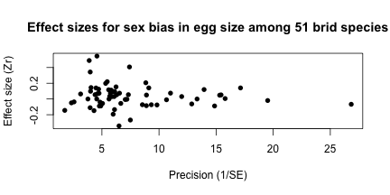
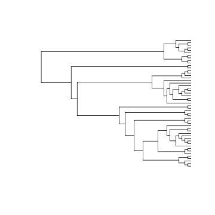

## Phylogenetic Comparative Methods

The development of phylogenetic comparative methods has made phylogenies and
important source of data in fields as diverse as ecology, genomic and medicine.
Comparative  methods can be used to investigate patterns in the evolution of
traits or the diversification of lineages. In other cases a phylogeny is treated
as a "nuisance parameter", allowing with the autocorrelation created by the shared
evolutionary history of the different species included to be controlled for.

In many cases finding a tree that relates the species for which trait data are
available is a rate-limiting step in such comparative analyses. Here we show
how the synthetic tree provided by Open Tree of Life (and made available in R via
`rotl`) can help to fill this gap.

## A phylogenetic meta-analysis

To demonstrate the use of `rotl` in a comparative analysis, we will partially
reproduce the results of [Rutkowska _et al_ 2014](https://doi.org/10.1111/jeb.12282).
Very briefly, this study is a meta-analysis summarising the results of multiple
studies testing for systematic differences in the size of eggs which contain
male and female offspring. Such a difference might mean that birds invest more
heavily in one sex than the other.

Because this study involves data from 51 different species, Rutkowska _et al_
used a phylogenetic comparative approach to account for the shared evolutionary
history among some of the studied-species.

### Gather the data

If we are going to reproduce this analysis, we will first need to gather the
data. Thankfully, the data is available as supplementary material from the
publisher's website. We provide a copy of this data with the package:


```r
library(rotl)
```


```r
## This dataset is available from the publisher's study website:
egg_data <- read.csv(system.file("extdata", "egg.csv", package = "rotl"),
  stringsAsFactors = FALSE
)
## }
head(egg_data)
```

```
##                   animal                   Spp       Lndim Measure Neggs
## 1 Zonotrichia_leucophrys White-crowned sparrow 0.000000000  volume   294
## 2      Passer_domesticus         House sparrow 0.009407469  volume   149
## 3        Serinus_canaria                Canary 0.000000000  volume    52
## 4          Turdus_merula    European blackbird 0.021189299  volume    82
## 5    Agelaius_phoeniceus  Red-winged blackbird 0.218316086  volume   394
## 6    Quiscalus_mexicanus  Great-tailed grackle 0.281894985    mass   822
##   Nclutches        ESr Type         StudyID Year        D        EN         Zr
## 1        73 0.14004594 stat        Mead1987 1987 3.421918  85.91673 0.14097244
## 2        31 0.11175203 stat     Cordero2000 2000 4.045161  36.83413 0.11222075
## 3        21 0.49679140 stat     Leitner2006 2006 2.180952  23.84279 0.54503712
## 4        54 0.38598540 stat     Martyka2010 2010 1.414815  57.95812 0.40707397
## 5       106 0.07410136  raw Weatherhead1985 1985 3.173585 124.14982 0.07423744
## 6       205 0.05178834  raw     Teather1989 1989 3.407805 241.21099 0.05183471
##           VZr
## 1 0.012060292
## 2 0.029555954
## 3 0.047978211
## 4 0.018195675
## 5 0.008254242
## 6 0.004197959
```

The most important variable in this dataset is `Zr`, which is a [normalized
effect size](https://en.wikipedia.org/wiki/Fisher_transformation) for difference
,in size between eggs that contain males and females. Values close to zero come
from studies that found the sex of an egg's inhabitant had little effect in its size,
while large positive or negative values correspond to studies with substantial
sex biases (towards males and females respectively). Since this is a
meta-analysis we should produce the classic [funnel plot](https://en.wikipedia.org/wiki/Funnel_plot)
with effects-size on the y-axis and precision (the inverse of the sample
standard error) on the x-axis. Here we calculate precision from the sample
variance (`Vzr`):


```r
plot(1 / sqrt(egg_data$VZr), egg_data$Zr,
  pch = 16,
  ylab = "Effect size (Zr)",
  xlab = "Precision (1/SE)",
  main = "Effect sizes for sex bias in egg size among 51 brid species"
)
```



In order to use this data later on we need to first convert it to a standard
`data.frame`. We can also convert the `animal` column (the species names) to
lower case, and remove the underscores in their names, which will make it easier to match names later on:


```r
egg_data <- as.data.frame(egg_data)
## Convert taxon names to lower case
egg_data$animal <- tolower(egg_data$animal)
## Let's remove the underscores (_) from the taxon names
egg_data$animal <- gsub("_", " ", egg_data$animal)
```
### Find the species in OTT

We can use the OTL synthesis tree to relate these species. To do so we first need to
find Open Tree Taxonomy (OTT) IDs for each species. We can do that with the
Taxonomic Name Resolution Service function `tnrs_match_names`:


```r
taxa <- tnrs_match_names(unique(egg_data$animal), context = "Animals")
```

```
## Warning in tnrs_match_names(unique(egg_data$animal), context = "Animals"):
## partial argument match of 'context' to 'context_name'
```

```r
head(taxa)
```

```
##            search_string            unique_name approximate_match ott_id
## 1 zonotrichia leucophrys Zonotrichia leucophrys             FALSE 265553
## 2      passer domesticus      Passer domesticus             FALSE 745175
## 3        serinus canaria        Serinus canaria             FALSE 464865
## 4          turdus merula          Turdus merula             FALSE 568572
## 5    agelaius phoeniceus    Agelaius phoeniceus             FALSE 226605
## 6    quiscalus mexicanus    Quiscalus mexicanus             FALSE 743411
##   is_synonym          flags number_matches
## 1      FALSE                             1
## 2      FALSE                             1
## 3      FALSE sibling_higher              1
## 4      FALSE                             1
## 5      FALSE                             1
## 6      FALSE                             1
```

All of these species are in OTT, but a few of them go by different names in the
Open Tree than we have in our data set. Because the tree `rotl` fetches
will have Open Tree names, we need to create a named vector that maps the names
we have for each species to the names Open Tree uses for them:


```r
taxon_map <- structure(taxa$search_string, names = taxa$unique_name)
```

Now we can use this map to retrieve "data set names" from "OTT names":


```r
taxon_map["Anser caerulescens"]
```

```
##  Anser caerulescens 
## "chen caerulescens"
```

### Get a tree

Now we can get the tree. There are really too many tips here to show nicely, so
we will leave them out of this plot


```r
tr <- tol_induced_subtree(ott_id(taxa)[is_in_tree(ott_id(taxa))])
```

```
## Warning in collapse_singles(tr, show_progress): Dropping singleton nodes
## with labels: mrcaott246ott5481, mrcaott246ott7145, mrcaott246ott928360,
## mrcaott246ott1858, mrcaott246ott2907, mrcaott246ott3600042, mrcaott246ott7113,
## Passeriformes ott1041547, mrcaott246ott3212, mrcaott246ott428578,
## mrcaott246ott44866, mrcaott246ott5929, mrcaott246ott32658,
## mrcaott246ott310390, mrcaott246ott176461, mrcaott246ott22325,
## mrcaott246ott10351, mrcaott246ott193904, mrcaott246ott5934, mrcaott246ott1566,
## mrcaott1566ott3598440, mrcaott1566ott496009, mrcaott1566ott59716,
## mrcaott1566ott32651, mrcaott1566ott24297, mrcaott1566ott45312,
## mrcaott1566ott22300, mrcaott22300ott35350, mrcaott22300ott547548,
## mrcaott22300ott909199, mrcaott22300ott67150, mrcaott22300ott130294,
## mrcaott22300ott3598245, mrcaott22300ott416087, mrcaott22300ott629342,
## mrcaott22300ott416089, mrcaott22300ott107840, mrcaott364210ott451069,
## mrcaott364210ott3598839, mrcaott3598839ott5341363, mrcaott19467ott431648,
## mrcaott19467ott252687, mrcaott19467ott401023, mrcaott19467ott233446,
## mrcaott19467ott168078, mrcaott19467ott1046624, mrcaott19467ott161293,
## mrcaott19467ott46396, mrcaott46396ott46398, mrcaott46398ott168083,
## mrcaott168083ott431676, mrcaott2175ott35326, mrcaott2175ott968664,
## mrcaott2175ott259082, mrcaott2175ott59905, mrcaott2175ott2224,
## mrcaott2224ott366470, mrcaott3364ott310375, mrcaott3364ott3370,
## mrcaott4083ott35042, mrcaott4083ott370807, mrcaott4083ott469177,
## mrcaott4083ott18592, mrcaott4083ott139823, mrcaott4083ott11712,
## mrcaott4083ott95949, Erythrura ott465905, mrcaott24017ott389884,
## mrcaott24017ott24025, mrcaott24025ott596763, mrcaott24025ott453058,
## mrcaott24025ott141501, mrcaott141501ott966119, mrcaott141501ott865472,
## mrcaott141501ott389883, mrcaott105913ott311555, mrcaott311555ott1082386,
## mrcaott311555ott708327, mrcaott708327ott966122, mrcaott4088ott8371,
## mrcaott4088ott5616, mrcaott5616ott28339, mrcaott5616ott6023,
## mrcaott6023ott243614, mrcaott6023ott101225, mrcaott6023ott125079,
## mrcaott125079ott463026, mrcaott125079ott765405, Zonotrichia (genus in
## domain Eukaryota) ott789032, mrcaott125079ott265547, mrcaott125079ott265554,
## mrcaott5620ott254662, mrcaott5620ott29804, mrcaott29804ott449580,
## mrcaott29804ott449562, mrcaott29804ott86894, mrcaott29804ott93045,
## mrcaott93045ott264496, mrcaott264496ott264500, mrcaott264500ott3597163,
## mrcaott264500ott283668, Quiscalus ott743410, mrcaott283673ott673386,
## mrcaott283673ott741944, mrcaott283673ott735243, mrcaott213448ott213452,
## mrcaott213448ott1009279, mrcaott213448ott213451, mrcaott213454ott430627,
## mrcaott430627ott498751, mrcaott430627ott617797, mrcaott430627ott3597159,
## mrcaott99175ott364331, Xanthocephalus ott364336, mrcaott6366ott28332,
## mrcaott6366ott88283, mrcaott6366ott341465, mrcaott6366ott157599,
## mrcaott6366ott178457, mrcaott6366ott405215, mrcaott6366ott238142,
## mrcaott6366ott6375, mrcaott6375ott119724, mrcaott6375ott238137,
## mrcaott238137ott328909, mrcaott238137ott464865, Haemorhous ott3601758,
## mrcaott9416ott840030, mrcaott9416ott96148, mrcaott9416ott7068473, Passer
## ott515158, mrcaott9416ott407769, mrcaott9416ott25628, mrcaott9416ott407764,
## mrcaott9416ott68955, mrcaott9416ott73636, mrcaott1488ott72472,
## mrcaott1488ott63797, mrcaott1488ott284404, mrcaott1488ott107463,
## mrcaott1488ott17016, mrcaott1488ott44217, mrcaott1488ott16185,
## mrcaott16185ott274931, Hirundinidae ott897681, mrcaott16185ott67916,
## mrcaott67916ott67921, mrcaott67916ott368059, mrcaott67916ott67920,
## Delichon ott922719, mrcaott107476ott177058, mrcaott107476ott271376,
## mrcaott107476ott337752, mrcaott337752ott7661935, mrcaott337752ott337762,
## mrcaott337752ott7068616, mrcaott2375ott73144, mrcaott2375ott124085,
## mrcaott2375ott71358, mrcaott2375ott814750, mrcaott2375ott61147,
## mrcaott84656ott123763, mrcaott123763ott728471, mrcaott123763ott258794,
## mrcaott4820ott409116, mrcaott4820ott17162, mrcaott4820ott20998,
## mrcaott4820ott20989, mrcaott4820ott58860, mrcaott4820ott23690,
## mrcaott4820ott20996, mrcaott4820ott11462, mrcaott4820ott140440,
## mrcaott4820ott197505, mrcaott4820ott75978, mrcaott4820ott11315,
## mrcaott4820ott5933, mrcaott5933ott60465, mrcaott5933ott25637,
## mrcaott25637ott199843, mrcaott25637ott473431, mrcaott25637ott686166,
## mrcaott25637ott111993, mrcaott25637ott183621, mrcaott183621ott501241,
## mrcaott501241ott3598010, mrcaott501241ott597018, mrcaott686165ott686168,
## mrcaott60456ott662804, mrcaott60456ott75990, Pica ott776480, Falconiformes
## ott212187, Falconidae ott212186, mrcaott47588ott225286, mrcaott47588ott748842,
## mrcaott47588ott201377, mrcaott201377ott773020, Cerchneis ott3596159,
## mrcaott179290ott352521, mrcaott179290ott624976, mrcaott179290ott624973,
## mrcaott179290ott624974, mrcaott179290ott432111, mrcaott5272ott92263,
## mrcaott5272ott24121, Scolopacidae ott887699, mrcaott24121ott217797,
## mrcaott24121ott45306, mrcaott24121ott654830, mrcaott24121ott214779,
## mrcaott24121ott651066, mrcaott651066ott1090732, mrcaott7639ott306220,
## mrcaott7639ott57833, mrcaott7639ott383929, mrcaott7639ott279504,
## mrcaott7639ott47401, mrcaott7639ott341047, mrcaott7639ott234666,
## mrcaott7639ott341034, mrcaott7639ott285543, Sterna ott16767,
## mrcaott285543ott341030, mrcaott285543ott738509, mrcaott285543ott966606,
## mrcaott285543ott966604, mrcaott22965ott738512, mrcaott22965ott80679,
## mrcaott22965ott558955, mrcaott22965ott154126, mrcaott22965ott241571,
## mrcaott22965ott282132, mrcaott22965ott414141, mrcaott22965ott704174,
## mrcaott22965ott704175, mrcaott22965ott324050, mrcaott22965ott353849,
## mrcaott22965ott75913, mrcaott75913ott335736, mrcaott306645ott450107,
## mrcaott425206ott887691, mrcaott425206ott515355, mrcaott119599ott993041,
## mrcaott119599ott509055, mrcaott698969ott4947414, mrcaott147723ott219032,
## Stercorariidae ott168297, Stercorarius ott742632, mrcaott742640ott742641,
## mrcaott57823ott57827, mrcaott57823ott242771, mrcaott57823ott112937,
## mrcaott112937ott129402, mrcaott112937ott454019, mrcaott112937ott242776,
## mrcaott242776ott313115, mrcaott242776ott704464, mrcaott242776ott331994,
## mrcaott331994ott413796, mrcaott9830ott86672, mrcaott9830ott90560,
## mrcaott9830ott324158, mrcaott9830ott55044, mrcaott9830ott285638,
## mrcaott9830ott117726, Sulidae ott452462, mrcaott170197ott403772, Sula ott160486,
## mrcaott170197ott5859716, mrcaott170197ott429615, mrcaott429615ott1030312,
## Procellariiformes ott452461, mrcaott18206ott31011, mrcaott31011ott71459,
## Diomedeidae ott85277, mrcaott71459ott320282, Phoebastria ott941509,
## mrcaott320282ott320284, Sphenisciformes ott494366, Spheniscidae ott494367,
## mrcaott60413ott3600120, mrcaott60413ott4130813, mrcaott60413ott4130835,
## mrcaott60413ott4130830, mrcaott60413ott3600127, mrcaott60413ott4130831,
## mrcaott60413ott3600124, mrcaott60413ott3600128, mrcaott60413ott3600129,
## mrcaott60413ott4130819, mrcaott60413ott4130817, mrcaott60413ott60417,
## mrcaott60413ott3600131, mrcaott60413ott917663, Eudyptes ott494364,
## mrcaott82219ott116946, mrcaott116946ott219197, mrcaott134466ott494361,
## Pygoscelis ott494365, mrcaott134466ott783352, mrcaott5021ott198671,
## mrcaott5021ott75792, Cuculiformes ott212171, mrcaott75792ott212172,
## mrcaott75792ott3601282, mrcaott75792ott119216, mrcaott119216ott212175,
## mrcaott119216ott169265, mrcaott169265ott550039, mrcaott169265ott462546,
## mrcaott462546ott3596355, mrcaott462546ott1050027, Cuculus ott1041429,
## mrcaott549514ott7068132, mrcaott549514ott3596308, mrcaott549514ott3596307,
## mrcaott549514ott3596306, mrcaott549514ott792626, mrcaott17146ott57819,
## Columbiformes ott363030, mrcaott17146ott45505, mrcaott45505ott50388,
## mrcaott45505ott506098, mrcaott45505ott51607, mrcaott51607ott277822,
## mrcaott51607ott67614, mrcaott51607ott244134, Columba ott938415,
## mrcaott51607ott277817, mrcaott277817ott320359, mrcaott320359ott493986,
## mrcaott320359ott767317, mrcaott320359ott921832, mrcaott320359ott938416,
## Galliformes ott837585, mrcaott4765ott6520194, mrcaott4765ott109888,
## mrcaott4765ott75785, mrcaott4765ott104461, mrcaott4765ott151684,
## mrcaott4765ott54193, mrcaott4765ott49319, mrcaott4765ott3596087,
## mrcaott4765ott415487, mrcaott4765ott51354, mrcaott4765ott446490, Tetraoninae
## ott999677, mrcaott4765ott55929, mrcaott4765ott539045, mrcaott4765ott234824,
## Centrocercus ott728081, mrcaott53700ott572162, mrcaott53700ott466627,
## mrcaott53700ott309383, mrcaott53700ott102722, mrcaott102722ott137547, Phasianus
## ott102718, mrcaott49310ott102705, mrcaott49310ott153554, mrcaott153554o
```

```r
plot(tr, show.tip.label = FALSE)
```



There are a few things to note here. First, the tree has no branch lengths.
At present this is true for the whole of the Open Tree synthetic tree. Some
comparative methods require either branch lengths or an ultrametric tree. Before
you can use one of those methods you will need to get a tree with branch
lengths. You could try looking for published trees made available by the Open
Tree with `studies_find_trees`. Alternatively, you could estimate branch lengths
from the toplogy of a phylogeny returned by `tol_induced_subtree`, perhaps by
downloading DNA sequences from the NCBI with `rentrez` or "hanging" the tree on
nodes of known-age using  penalized likelihood method in `ape::chronos`.
In this case, we will use only the topology of the tree as input to our
comparative analysis, so we can skip these steps.

Second, the tip labels contain OTT IDs, which means they will not perfectly
match the species names in our dataset or the taxon map that we created earlier:


```r
tr$tip.label[1:4]
```

```
## [1] "Ficedula_albicollis_ott107840" "Luscinia_svecica_ott274225"   
## [3] "Turdus_merula_ott568572"       "Sturnus_unicolor_ott366470"
```

Finally, the tree contains node labels for those nodes that match a higher taxonomic
group, and empty character vectors (`""`) for all other nodes. Some
comparative methods either do no expect node labels at all, or require all
labeled nodes to have a unique name (meaning multiple "empty" labels will cause
and error).

We can deal with all these details easily. `rotl` provides  the convenience
function `strip_ott_ids` to remove the extra information from the tip labels.
With the IDs removed, we can use our taxon map to replace the tip labels in the tree
with the species names from dataset.


```r
otl_tips <- strip_ott_ids(tr$tip.label, remove_underscores = TRUE)
tr$tip.label <- taxon_map[ otl_tips ]
```

Finally, we can remove the node labels by setting the `node.label` attribute of
the tree to `NULL`.


```r
tr$node.label <- NULL
```


```r
egg_data <- egg_data[egg_data$animal %in% tr$tip.label, ]
```


### Perform the meta-analysis


Now we have data and a tree, and we know the names in the tree match the ones in
the data. It's time to do the comparative analysis. Rutkowska _et al_. used `MCMCglmm`, a
Bayesian MCMC approach to fitting multi-level models,to perform their meta-analysis,
and we will do the same. Of course, to properly analyse these data you would
take some care in deciding on the appropriate priors to use and inspect the
results carefully. In this case, we are really interested in using this as a
demonstration, so we will just run a simple model.

Specifically we sill fit a model where the only variable that might explain the
values of `Zr` is the random factor `animal`, which corresponds to the
phylogenetic relationships among species. We also provide `Zvr` as the measurement
error variance, effectively adding extra weight to the results of more powerful
studies. Here's how we specify and fit that model with `MCMCglmm`:


```r
set.seed(123)
if (require(MCMCglmm, quietly = TRUE)) {
  pr <- list(
    R = list(V = 1, nu = 0.002),
    G = list(G1 = list(V = 1, nu = 0.002))
  )

  model <- MCMCglmm(Zr ~ 1,
    random = ~animal,
    pedigree = tr,
    mev = egg_data$VZr,
    prior = pr,
    data = egg_data,
    verbose = FALSE
  )
} else {
  model <- readRDS(file = system.file("extdata", "mcmcglmm_model.rds", package = "rotl"))
}
```

```
## Warning in inverseA(pedigree = pedigree, scale = scale, nodes = nodes): no
## branch lengths: compute.brlen from ape has been used
```

```
## Warning in sing.rm$coef: partial match of 'coef' to 'coefficients'
```

```
## Warning in x$n: partial match of 'n' to 'nu'

## Warning in x$n: partial match of 'n' to 'nu'

## Warning in x$n: partial match of 'n' to 'nu'

## Warning in x$n: partial match of 'n' to 'nu'

## Warning in x$n: partial match of 'n' to 'nu'

## Warning in x$n: partial match of 'n' to 'nu'
```


Now that we have a result we can find out how much phylogenetic signal exists
for sex-biased differences in egg-size. In a multi-level model we can use variance
components to look at this, specifically the proportion of the total variance
that can be explained by phylogeny is called the phylogenetic reliability, _H_. Let's
calculate the _H_ for this model:


```r
var_comps <- colMeans(model$VCV)
var_comps["animal"] / sum(var_comps)
```

```
##     animal 
## 0.00283581
```

It appears there is almost no phylogenetic signal to the data.
The relationships among species explain much less that one percent of the total
variance in the data. If you were wondering,  Rutkowska _et al_. report a similar result,
even after adding more predictors to their model most of the variance in `Zr`
was left unexplained.

## What other comparative methods can I use in R?

Here we have demonstrated just one comparative analysis that you might
do in R.  There are an ever-growing number of packages that allow an
ever-growing number of analysis to performed in R. Some "classics"
like ancestral state reconstruction, phylogenetic independent
contrasts and lineage through time plots are implemented in
`ape`. Packages like `phytools`, `caper` and `diversitree` provide
extensions to these methods.  The [CRAN Phylogenetics
Taskview](https://github.com/bomeara/PhylogeneticsTaskView/blob/main/Phylogenetics.md)
gives a good idea of the diversity of packages and analyses that can
be completed in R (note that this links to a draft of the next version
of the Taskview as it is currently unavailable from CRAN).
