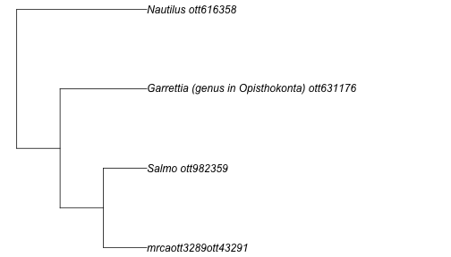
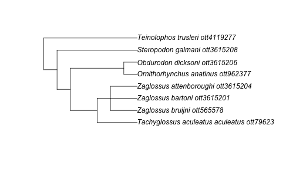
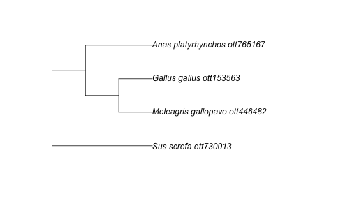

`rotl` provides an interface to the Open Tree of Life (OTL) API and allows users
to query the API, retrieve parts of the Tree of Life and integrate these parts
with other R packages.

The OTL API provides services to access:

* the **Tree of Life** a.k.a. TOL (the synthetic tree): a single draft tree that is
  a combination of **the OTL taxonomy** and the **source trees** (studies)
* the **Taxonomic name resolution services** a.k.a. TNRS: the methods for
  resolving taxonomic names to the internal identifiers used by the TOL and the
  GOL (the `ott ids`).
* the **Taxonomy** a.k.a. OTT (for Open Tree Taxonomy): which represents the
  synthesis of the different taxonomies used as a backbone of the TOL when no
  studies are available.
* the **Studies** containing the source trees used to build the TOL, and
  extracted from the scientific literature.

In `rotl`, each of these services correspond to functions with different
prefixes:

| Service       | `rotl` prefix |
|---------------|---------------|
| Tree of Life  | `tol_`        |
| TNRS          | `tnrs_`       |
| Taxonomy      | `taxonomy_`   |
| Studies       | `studies_`    |

`rotl` also provides a few other functions and methods that can be used to
extract relevant information from the objects returned by these functions.


## Demonstration of a basic workflow

The most common use for `rotl` is probably to start from a list of species and
get the relevant parts of the tree for these species. This is a two step
process:

1. the species names need to be matched to their `ott_id` (the Open Tree
	Taxonomy identifiers) using the Taxonomic name resolution services (TNRS)
1. these `ott_id` will then be used to retrieve the relevant parts of the Tree
   of Life.

### Step 1: Matching taxonomy to the `ott_id`

Let's start by doing a search on a diverse group of taxa: a tree frog (genus
_Hyla_), a fish (genus _Salmo_), a sea urchin (genus _Diadema_), and a nautilus
(genus _Nautilus_).


```r
library(rotl)
taxa <- c("Hyla", "Salmo", "Diadema", "Nautilus")
resolved_names <- tnrs_match_names(taxa)
```

It's always a good idea to check that the resolved names match what you
intended:


|search_string |unique_name |approximate_match |  ott_id|is_synonym |flags | number_matches|
|:-------------|:-----------|:-----------------|-------:|:----------|:-----|--------------:|
|hyla          |Hyla        |FALSE             | 1062216|FALSE      |      |              1|
|salmo         |Salmo       |FALSE             |  982359|FALSE      |      |              1|
|diadema       |Diadema     |FALSE             | 4930522|FALSE      |      |              4|
|nautilus      |Nautilus    |FALSE             |  616358|FALSE      |      |              1|


The column `unique_name` sometimes indicates the higher taxonomic level
associated with the name. The column `number_matches` indicates the number of
`ott_id` that corresponds to a given name. In this example, our search on
_Diadema_ returns 2 matches, and the one returned by default is indeed the sea
urchin that we want for our query. The argument `context_name` allows you to
limit the taxonomic scope of your search. _Diadema_ is also the genus name of a
fungus. To ensure that our search is limited to animal names, we could do:


```r
resolved_names <- tnrs_match_names(taxa, context_name = "Animals")
```

If you are trying to build a tree with deeply divergent taxa that the argument
`context_name` cannot fix, see "How to change the ott ids assigned to my taxa?"
in the FAQ below.


### Step 2: Getting the tree corresponding to our taxa

Now that we have the correct `ott_id` for our taxa, we can ask for the tree
using the `tol_induced_subtree()` function. By default, the object returned by
`tol_induced_subtree` is a phylo object (from the
[ape](https://cran.r-project.org/package=ape) package), so we can plot it
directly.


```r
my_tree <- tol_induced_subtree(ott_ids = resolved_names$ott_id)
```

```
## Warning in collapse_singles(tr, show_progress): Dropping singleton nodes
## with labels: Chordata ott125642, mrcaott42ott658, Craniata (subphylum in
## Deuterostomia) ott947318, Vertebrata (subphylum in Deuterostomia) ott801601,
## Gnathostomata (superclass in phylum Chordata) ott278114, Teleostomi
## ott114656, Sarcopterygii ott458402, Dipnotetrapodomorpha ott4940726,
## Tetrapoda ott229562, Amphibia ott544595, Batrachia ott471197, Anura ott991547,
## mrcaott114ott3129, mrcaott114ott37876, mrcaott114ott18818, Neobatrachia
## ott535804, mrcaott114ott309463, mrcaott114ott177, mrcaott177ott7464,
## mrcaott177ott2199, mrcaott177ott29310, mrcaott177ott1321, Hylidae ott535782,
## mrcaott177ott17126, mrcaott177ott43017, mrcaott177ott2732, mrcaott2732ott3289,
## mrcaott3289ott40328, mrcaott3289ott173489, mrcaott3289ott110534,
## mrcaott3289ott489758, mrcaott3289ott59160, Actinopterygii ott773483,
## Actinopteri ott285821, Neopterygii ott471203, Teleostei ott212201,
## Osteoglossocephalai ott5506109, Clupeocephala ott285819, Euteleosteomorpha
## ott5517919, mrcaott274ott392, mrcaott274ott595, Protacanthopterygii ott1024043,
## mrcaott274ott3887, mrcaott3887ott9371, Salmoniformes ott216171, Salmonidae
## ott739933, mrcaott3887ott28511, Salmoninae ott936925, mrcaott31485ott79094,
## mrcaott360ott10516, Echinodermata ott451020, Eleutherozoa ott317277, Echinozoa
## ott669475, Echinoidea ott669472, mrcaott360ott26831, mrcaott360ott3985,
## mrcaott360ott367, mrcaott360ott362, Acroechinoidea ott5677511, Diadematoida
## ott631174, Diadematidae ott631173, Protostomia ott189832, mrcaott49ott6612,
## Lophotrochozoa ott155737, mrcaott56ott519, mrcaott56ott5497, Mollusca ott802117,
## mrcaott56ott1881, mrcaott1881ott102410, Cephalopoda ott7368, Nautiloidea
## ott854446, Nautilida ott854452, Nautilidae ott616361
```

```r
plot(my_tree, no.margin = TRUE)
```




## FAQ

### How to change the ott ids assigned to my taxa?

If you realize that `tnrs_match_names` assigns the incorrect taxonomic group to
your name (e.g., because of synonymy) and changing the `context_name` does not
help, you can use the function `inspect`. This function takes the object
resulting from `tnrs_match_names()`, and either the row number, the taxon name
(you used in your search in lowercase), or the `ott_id` returned by the initial
query.

To illustrate this, let's re-use the previous query but this time pretending that
we are interested in the fungus _Diadema_ and not the sea urchin:


```r
taxa <- c("Hyla", "Salmo", "Diadema", "Nautilus")
resolved_names <- tnrs_match_names(taxa)
resolved_names
```

```
##   search_string unique_name approximate_match  ott_id is_synonym flags
## 1          hyla        Hyla             FALSE 1062216      FALSE      
## 2         salmo       Salmo             FALSE  982359      FALSE      
## 3       diadema     Diadema             FALSE 4930522      FALSE      
## 4      nautilus    Nautilus             FALSE  616358      FALSE      
##   number_matches
## 1              1
## 2              1
## 3              4
## 4              1
```

```r
inspect(resolved_names, taxon_name = "diadema")
```

```
##   search_string                       unique_name approximate_match  ott_id
## 1       diadema                           Diadema             FALSE 4930522
## 2       diadema                       Diademoides             FALSE 4024672
## 3       diadema Garrettia (genus in Opisthokonta)             FALSE  631176
## 4       diadema                        Hypolimnas             FALSE  643831
##   is_synonym          flags number_matches
## 1      FALSE                             4
## 2       TRUE sibling_higher              4
## 3       TRUE                             4
## 4       TRUE                             4
```

In our case, we want the second row in this data frame to replace the
information that initially matched for _Diadema_. We can now use the `update()`
function, to change to the correct taxa (the fungus not the sea urchin):


```r
resolved_names <- update(resolved_names,
  taxon_name = "diadema",
  new_row_number = 2
)

## we could also have used the ott_id to replace this taxon:
## resolved_names <- update(resolved_names, taxon_name = "diadema",
##                          new_ott_id = 4930522)
```

And now our `resolved_names` data frame includes the taxon we want:


|search_string |unique_name |approximate_match |  ott_id|is_synonym |flags          | number_matches|
|:-------------|:-----------|:-----------------|-------:|:----------|:--------------|--------------:|
|hyla          |Hyla        |FALSE             | 1062216|FALSE      |               |              1|
|salmo         |Salmo       |FALSE             |  982359|FALSE      |               |              1|
|diadema       |Diademoides |FALSE             | 4024672|TRUE       |sibling_higher |              4|
|nautilus      |Nautilus    |FALSE             |  616358|FALSE      |               |              1|


### How do I know that the taxa I'm asking for is the correct one?

The function `taxonomy_taxon_info()` takes `ott_ids` as arguments and returns
taxonomic information about the taxa. This output can be passed to some helpers
functions to extract the relevant information. Let's illustrate this with our
_Diadema_ example


```r
diadema_info <- taxonomy_taxon_info(631176)
tax_rank(diadema_info)
```

```
## $`Garrettia (genus in Opisthokonta)`
## [1] "genus"
## 
## attr(,"class")
## [1] "otl_rank" "list"
```

```r
synonyms(diadema_info)
```

```
## $`Garrettia (genus in Opisthokonta)`
## [1] "Centrechinus" "Diadema"      "Diamema"     
## 
## attr(,"class")
## [1] "otl_synonyms" "list"
```

```r
tax_name(diadema_info)
```

```
## $`Garrettia (genus in Opisthokonta)`
## [1] "Garrettia"
## 
## attr(,"class")
## [1] "otl_name" "list"
```

In some cases, it might also be useful to investigate the taxonomic tree
descending from an `ott_id` to check that it's the correct taxon and to
determine the species included in the Open Tree Taxonomy:


```r
diadema_tax_tree <- taxonomy_subtree(631176)
diadema_tax_tree
```

```
## $tip_label
##  [1] "Garrettia_parva_ott6356094"              
##  [2] "Garrettia_rotella_ott6356095"            
##  [3] "Diadema_savignyi_ott395692"              
##  [4] "Diadema_palmeri_ott836860"               
##  [5] "Diadema_setosum_ott631175"               
##  [6] "Diadema_paucispinum_ott312263"           
##  [7] "unclassified_Diadema_ott7669081"         
##  [8] "Diadema_africanum_ott4147369"            
##  [9] "Diadema_antillarum_scensionis_ott220009" 
## [10] "Diadema_antillarum_antillarum_ott4147370"
## [11] "Diadema_mexicanum_ott639130"             
## [12] "Diademasp.SP04-BIO_4_JGLCO_AYott7072105" 
## [13] "Diademasp.SP03-BIO_3_JGLCO_AYott7072104" 
## [14] "Diademasp.SP02-BIO_2_JGLCO_AYott7072103" 
## [15] "Diadema_sp._DSM1_ott219999"              
## [16] "Diadema_sp._DSM6_ott771059"              
## [17] "Diademasp.ACOSTI-NIOTSU3ott7072098"      
## [18] "Diademasp.LI03-BIO_JGLCO_AYott7072102"   
## [19] "Diademasp.LI02-BIO_JGLCO_AYott7072101"   
## [20] "Diademasp.LI01-BIO_JGLCO_AYott7072100"   
## [21] "Diademasp.ACOSTI-NIOTSU4ott7072099"      
## [22] "Diadema_sp._seto35_ott66618"             
## [23] "Diadema_sp._seto18_ott66623"             
## [24] "Diadema_sp._seto19_ott66624"             
## [25] "Diadema_sp._seto38_ott66625"             
## [26] "Diadema_sp._DJN9_ott66626"               
## [27] "Diademasp.CS-2014ott5502179"             
## [28] "Diadema_sp._seto17_ott587478"            
## [29] "Diadema_sp._SETO15_ott587479"            
## [30] "Diadema_sp._dsm5_ott587480"              
## [31] "Diadema_sp._DSM4_ott587481"              
## [32] "Diadema_sp._DSM3_ott587482"              
## [33] "Diadema_sp._DSM2_ott587483"              
## [34] "Diadema_sp._seto10_ott587484"            
## [35] "Diadema_sp._seto9_ott587485"             
## [36] "Diadema_sp._DSM8_ott587486"              
## [37] "Diadema_sp._DSM7_ott587487"              
## [38] "Diadema_sp._seto16_ott312262"            
## [39] "Diadema_africana_ott5502180"             
## [40] "Diadema_principeana_ott5725746"          
## [41] "Diadema_vetus_ott5725747"                
## [42] "Diadema_regnyi_ott7669077"               
## [43] "Diadema_amalthei_ott7669073"             
## [44] "Diadema_affine_ott7669072"               
## [45] "Diadema_subcomplanatum_ott7669079"       
## [46] "Diadema_ruppelii_ott7669078"             
## [47] "Diadema_calloviensis_ott7669074"         
## [48] "Diadema_megastoma_ott7669075"            
## [49] "Diadema_priscum_ott7669076"              
## [50] "Garrettia_biangulata_ott7669080"         
## [51] "Diadema_ascensionis_ott4950423"          
## [52] "Diadema_lobatum_ott4950422"              
## 
## $edge_label
## [1] "Diadema_antillarum_ott1022356"  "'Garrettia(genusinOpisthokonta"
## [3] "ott631176'"
```

By default, this function return all taxa (including self, and internal)
descending from this `ott_id` but it also possible to return `phylo` object.

### How do I get the tree for a particular taxonomic group?

If you are looking to get the tree for a particular taxonomic group, you need to
first identify it by its node id or ott id, and then use the `tol_subtree()`
function:


```r
mono_id <- tnrs_match_names("Monotremata")
mono_tree <- tol_subtree(ott_id = ott_id(mono_id))
```

```
## Warning in collapse_singles(tr, show_progress): Dropping singleton nodes
## with labels: Tachyglossus ott16047, Tachyglossus aculeatus ott16038,
## Ornithorhynchidae ott344066, Ornithorhynchus ott962391
```

```r
plot(mono_tree)
```




### How do I find trees from studies focused on my favourite taxa?

The function `studies_find_trees()` allows the user to search for studies
matching a specific criteria. The function `studies_properties()` returns the
list of properties that can be used in the search.


```r
furry_studies <- studies_find_studies(property = "ot:focalCladeOTTTaxonName", value = "Mammalia")
furry_ids <- furry_studies$study_ids
```

Now that we know the `study_id`, we can ask for the meta data information
associated with this study:


```r
furry_meta <- get_study_meta("pg_2550")
get_publication(furry_meta) ## The citation for the source of the study
```

```
## [1] "O'Leary, Maureen A., Marc Allard, Michael J. Novacek, Jin Meng, and John Gatesy. 2004. \"Building the mammalian sector of the tree of life: Combining different data and a discussion of divergence times for placental mammals.\" In: Cracraft J., & Donoghue M., eds. Assembling the Tree of Life. pp. 490-516. Oxford, United Kingdom, Oxford University Press."
## attr(,"DOI")
## [1] ""
```

```r
get_tree_ids(furry_meta) ## This study has 10 trees associated with it
```

```
##  [1] "tree5513" "tree5515" "tree5516" "tree5517" "tree5518" "tree5519"
##  [7] "tree5520" "tree5521" "tree5522" "tree5523"
```

```r
candidate_for_synth(furry_meta) ## None of these trees are yet included in the OTL
```

```
## NULL
```

Using `get_study("pg_2550")` would returns a `multiPhylo` object (default) with
all the trees associated with this particular study, while
`get_study_tree("pg_2550", "tree5513")` would return one of these trees.

### The tree returned by the API has duplicated tip labels, how can I work around it?

You may encounter the following error message:

```
Error in rncl(file = file, ...) : Taxon number 39 (coded by the token Pratia
angulata) has already been encountered in this tree. Duplication of taxa in a
tree is prohibited.
```

This message occurs as duplicate labels are not allowed in the NEXUS format and
it is stricly enforced by the part of the code used by `rotl` to import the
trees in memory.

If you use a version of `rotl` more recent than 0.4.1, this should not happen by
default for the function `get_study_tree`. If it happens with another function,
please [let us know](https://github.com/ropensci/rotl/issues).

The easiest way to work around this is to save the tree in a file, and use APE
to read it in memory:


```r
get_study_tree(
  study_id = "pg_710", tree_id = "tree1277",
  tip_label = "ott_taxon_name", file = "/tmp/tree.tre",
  file_format = "newick"
)
tr <- ape::read.tree(file = "/tmp/tree.tre")
```

### How do I get the higher taxonomy for a given taxa?

If you encounter a taxon name you are not familiar with, it might be useful to
obtain its higher taxonomy to see where it fits in the tree of life. We can
combine several taxonomy methods to extract this information easily.


```r
giant_squid <- tnrs_match_names("Architeuthis")
tax_lineage(taxonomy_taxon_info(ott_id(giant_squid), include_lineage = TRUE))
```

```
## $`564394`
##          rank               name        unique_name  ott_id
## 1      family     Architeuthidae     Architeuthidae  564393
## 2       order          Oegopsida          Oegopsida   43352
## 3  superorder     Decapodiformes     Decapodiformes  854107
## 4  infraclass       Neocoleoidea       Neocoleoidea  329546
## 5    subclass          Coleoidea          Coleoidea    7371
## 6       class        Cephalopoda        Cephalopoda    7368
## 7      phylum           Mollusca           Mollusca  802117
## 8     no rank     Lophotrochozoa     Lophotrochozoa  155737
## 9     no rank        Protostomia        Protostomia  189832
## 10    no rank          Bilateria          Bilateria  117569
## 11    no rank          Eumetazoa          Eumetazoa  641038
## 12    kingdom            Metazoa            Metazoa  691846
## 13    no rank            Holozoa            Holozoa 5246131
## 14    no rank       Opisthokonta       Opisthokonta  332573
## 15     domain          Eukaryota          Eukaryota  304358
## 16    no rank cellular organisms cellular organisms   93302
## 17    no rank               life               life  805080
```

### Why are OTT IDs discovered with `rotl` missing from an induced subtree?

Some taxonomic names that can be retrieved through the taxonomic name
resolution service are not part of the Open Tree's synthesis tree. These are
usually traditional higher-level taxa that have been found to be paraphyletic.

For instance, if you wanted to fetch a tree relating the three birds that go
into a [Turkducken](https://en.wikipedia.org/wiki/Turducken) as well as the pork
used for stuffing, you might search for the turkey, duck, chicken, and pork
genera:


```r
turducken <- c("Meleagris", "Anas", "Gallus", "Sus")
taxa <- tnrs_match_names(turducken, context = "Animals")
```

```
## Warning in tnrs_match_names(turducken, context = "Animals"): partial argument
## match of 'context' to 'context_name'
```

```r
taxa
```

```
##   search_string unique_name approximate_match ott_id is_synonym flags
## 1     meleagris   Meleagris             FALSE 446481      FALSE      
## 2          anas        Anas             FALSE 765185      FALSE      
## 3        gallus      Gallus             FALSE 153562      FALSE      
## 4           sus         Sus             FALSE 730021      FALSE      
##   number_matches
## 1              2
## 2              1
## 3              3
## 4              1
```

We have the OTT ids for each genus, however, if we tried to get the induced
subtree from these results, we would get an error:


```r
tr <- tol_induced_subtree(ott_id(taxa))
```

```
## Warning in collapse_singles(tr, show_progress): Dropping singleton nodes with
## labels: Mammalia ott244265, Theria (subclass in Deuterostomia) ott229558,
## Eutheria (in Deuterostomia) ott683263, Boreoeutheria ott5334778, Laurasiatheria
## ott392223, mrcaott1548ott4697, mrcaott1548ott6790, mrcaott1548ott3607484,
## mrcaott1548ott4942380, mrcaott1548ott4942547, mrcaott1548ott3021, Artiodactyla
## ott622916, mrcaott1548ott21987, Suina ott916745, Suidae ott730008, Sauropsida
## ott639642, Sauria ott329823, mrcaott246ott4128455, mrcaott246ott4127082,
## mrcaott246ott4129629, mrcaott246ott4142716, mrcaott246ott4126667,
## mrcaott246ott1662, mrcaott246ott2982, mrcaott246ott31216, mrcaott246ott4947920,
## mrcaott246ott4127428, mrcaott246ott4126230, mrcaott246ott4127421,
## mrcaott246ott664349, mrcaott246ott4126505, mrcaott246ott4127015,
## mrcaott246ott4129653, mrcaott246ott4127541, mrcaott246ott4946623,
## mrcaott246ott4126482, mrcaott246ott4128105, mrcaott246ott4127288,
## mrcaott246ott4132146, mrcaott246ott3602822, mrcaott246ott4143599,
## mrcaott246ott3600976, mrcaott246ott4132107, Aves ott81461, Neognathae
## ott241846, Galliformes ott837585, mrcaott4765ott6520194, mrcaott4765ott109888,
## mrcaott4765ott75785, mrcaott4765ott104461, mrcaott4765ott151684,
## mrcaott4765ott54193, mrcaott4765ott49319, mrcaott4765ott3596087,
## mrcaott4765ott415487, mrcaott4765ott51354, mrcaott4765ott53700,
## mrcaott4765ott446490, Meleagridinae ott781250, mrcaott49310ott102705,
## mrcaott49310ott51349, mrcaott49310ott153554, mrcaott153554ott867027,
## Anseriformes ott241841, mrcaott30843ott714464, Anatidae ott765193,
## mrcaott30843ott75874, mrcaott30843ott962771, mrcaott30843ott145504,
## mrcaott30843ott30847, mrcaott30843ott196654, mrcaott30843ott30845
```

As the error message suggests, some of the taxa are not found in the synthetic
tree. This occurs for 2 main reasons: either the taxa is invalid, or it is part
of a group that is not monophyletic in the synthetic tree. There are two ways to
get around this issue: (1) removing the taxa that are not part of the Open Tree;
(2) using the complete species name.

#### Removing the taxa missing from the synthetic tree

To help with this situation, `rotl` provides a way to identify the OTT ids that
are not part of the synthetic tree. The function `is_in_tree()` takes the output
of the `ott_id()` function and returns a vector of logical indicating whether
the taxa are part of the synthetic tree. We can then use to only keep the taxa that appear in the synthetic tree:


```r
in_tree <- is_in_tree(ott_id(taxa))
in_tree
```

```
## Meleagris      Anas    Gallus       Sus 
##      TRUE     FALSE      TRUE      TRUE
```

```r
tr <- tol_induced_subtree(ott_id(taxa)[in_tree])
```

```
## Warning in collapse_singles(tr, show_progress): Dropping singleton nodes with
## labels: Mammalia ott244265, Theria (subclass in Deuterostomia) ott229558,
## Eutheria (in Deuterostomia) ott683263, Boreoeutheria ott5334778, Laurasiatheria
## ott392223, mrcaott1548ott4697, mrcaott1548ott6790, mrcaott1548ott3607484,
## mrcaott1548ott4942380, mrcaott1548ott4942547, mrcaott1548ott3021,
## Artiodactyla ott622916, mrcaott1548ott21987, Suina ott916745, Suidae
## ott730008, Sauropsida ott639642, Sauria ott329823, mrcaott246ott4128455,
## mrcaott246ott4127082, mrcaott246ott4129629, mrcaott246ott4142716,
## mrcaott246ott4126667, mrcaott246ott1662, mrcaott246ott2982, mrcaott246ott31216,
## mrcaott246ott4947920, mrcaott246ott4127428, mrcaott246ott4126230,
## mrcaott246ott4127421, mrcaott246ott664349, mrcaott246ott4126505,
## mrcaott246ott4127015, mrcaott246ott4129653, mrcaott246ott4127541,
## mrcaott246ott4946623, mrcaott246ott4126482, mrcaott246ott4128105,
## mrcaott246ott4127288, mrcaott246ott4132146, mrcaott246ott3602822,
## mrcaott246ott4143599, mrcaott246ott3600976, mrcaott246ott4132107, Aves
## ott81461, Neognathae ott241846, Galloanserae ott5839486, Galliformes
## ott837585, mrcaott4765ott6520194, mrcaott4765ott109888, mrcaott4765ott75785,
## mrcaott4765ott104461, mrcaott4765ott151684, mrcaott4765ott54193,
## mrcaott4765ott49319, mrcaott4765ott3596087, mrcaott4765ott415487,
## mrcaott4765ott51354, mrcaott4765ott53700, mrcaott4765ott446490, Meleagridinae
## ott781250, mrcaott49310ott102705, mrcaott49310ott51349, mrcaott49310ott153554,
## mrcaott153554ott867027
```

#### Using the full taxonomic names

The best way to avoid these problems is to specify complete species names
(species being the lowest level of classification in the Open Tree taxonomy they
are guaranteed to be monophyletic):


```r
turducken_spp <- c("Meleagris gallopavo", "Anas platyrhynchos", "Gallus gallus", "Sus scrofa")
taxa <- tnrs_match_names(turducken_spp, context = "Animals")
```

```
## Warning in tnrs_match_names(turducken_spp, context = "Animals"): partial
## argument match of 'context' to 'context_name'
```

```r
tr <- tol_induced_subtree(ott_id(taxa))
```

```
## Warning in collapse_singles(tr, show_progress): Dropping singleton nodes with
## labels: Mammalia ott244265, Theria (subclass in Deuterostomia) ott229558,
## Eutheria (in Deuterostomia) ott683263, Boreoeutheria ott5334778, Laurasiatheria
## ott392223, mrcaott1548ott4697, mrcaott1548ott6790, mrcaott1548ott3607484,
## mrcaott1548ott4942380, mrcaott1548ott4942547, mrcaott1548ott3021, Artiodactyla
## ott622916, mrcaott1548ott21987, Suina ott916745, Suidae ott730008, Sus
## ott730021, Sauropsida ott639642, Sauria ott329823, mrcaott246ott4128455,
## mrcaott246ott4127082, mrcaott246ott4129629, mrcaott246ott4142716,
## mrcaott246ott4126667, mrcaott246ott1662, mrcaott246ott2982, mrcaott246ott31216,
## mrcaott246ott4947920, mrcaott246ott4127428, mrcaott246ott4126230,
## mrcaott246ott4127421, mrcaott246ott664349, mrcaott246ott4126505,
## mrcaott246ott4127015, mrcaott246ott4129653, mrcaott246ott4127541,
## mrcaott246ott4946623, mrcaott246ott4126482, mrcaott246ott4128105,
## mrcaott246ott4127288, mrcaott246ott4132146, mrcaott246ott3602822,
## mrcaott246ott4143599, mrcaott246ott3600976, mrcaott246ott4132107, Aves
## ott81461, Neognathae ott241846, Galliformes ott837585, mrcaott4765ott6520194,
## mrcaott4765ott109888, mrcaott4765ott75785, mrcaott4765ott104461,
## mrcaott4765ott151684, mrcaott4765ott54193, mrcaott4765ott49319,
## mrcaott4765ott3596087, mrcaott4765ott415487, mrcaott4765ott51354,
## mrcaott4765ott53700, mrcaott4765ott446490, Meleagridinae ott781250, Meleagris
## ott446481, mrcaott49310ott102705, mrcaott49310ott51349, mrcaott49310ott153554,
## mrcaott153554ott867027, Gallus ott153562, mrcaott153554ott153572,
## mrcaott153572ott240568, Anseriformes ott241841, mrcaott30843ott714464, Anatidae
## ott765193, mrcaott30843ott75874, mrcaott30843ott962771, mrcaott30843ott145504,
## mrcaott30843ott30847, mrcaott30843ott196654, mrcaott30843ott30845,
## mrcaott30845ott30850, mrcaott30850ott82420, mrcaott30850ott82414,
## mrcaott30850ott30858, mrcaott30850ott30855, mrcaott30850ott604172,
## mrcaott30850ott82410, mrcaott82410ott339494, mrcaott82410ott604175,
## mrcaott82410ott604182, mrcaott82410ott190881
```

```r
plot(tr)
```


